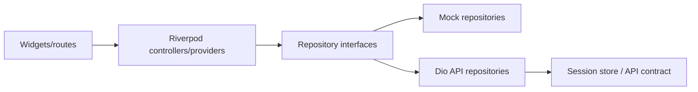

# Transmute Flutter demo architecture

## Locked technical decisions

- Flutter stable `3.44.6` and bundled Dart `3.12.2`, pinned through FVM and
  recorded in `.fvmrc` when implementation begins. This was the latest stable
  SDK version verified from the [Flutter SDK archive](https://docs.flutter.dev/install/archive)
  on 2026-08-11.
- `go_router` for routes and guards.
- Riverpod for application state and dependency injection.
- Dio for HTTP, interceptor-based auth, and retry classification.
- Freezed and `json_serializable` for immutable DTO/domain models.
- `flutter_secure_storage` for credentials; `shared_preferences` only for
  non-sensitive visual preferences if one is added later.
- No Drift/Isar in this scope. The API is authoritative; active-session
  recovery is server-backed. A small secure credential cache is sufficient.
- Material 3 with the exact custom tokens in `UI_SPEC.md`.

## Project layout

```text
lib/
  app/
    app.dart
    router.dart
    theme/
    responsive/
  core/
    api/
    auth/
    errors/
    persistence/
    utilities/
  features/
    authentication/{data,domain,presentation}/
    workout_plans/{data,domain,presentation}/
    active_session/{data,domain,presentation}/
    workout_history/{data,domain,presentation}/
  shared/
    widgets/
    models/
test/
integration_test/
```

Each feature has repositories/interfaces in domain, repository implementations
and DTO mapping in data, and widgets/controllers/providers in presentation.
Widgets must never call Dio or secure storage directly.

## Dependency flow



`RepositoryMode` is selected once during app bootstrap from dart defines and
injected through Riverpod. Feature code depends on repository interfaces, never
checks environment variables or switches between HTTP/mock branches itself.

## State ownership

| Concern | Owner |
| --- | --- |
| Access/refresh tokens | `AuthRepository` + secure session store. |
| Route protection | Router redirect derived from auth provider. |
| Plan/catalog/history reads | Async Riverpod providers keyed by query/entity ID. |
| Mutating active session | `ActiveSessionController`; it is the sole place for optimistic set updates and query invalidation. |
| Rest countdown display | View provider derived from persisted `restEndsAt` plus injected clock. |
| Network configuration | Bootstrap/config provider; never a widget constant. |

## Testing contract

- Unit-test domain unit conversion, timer deadline calculation, state
  transitions, DTO mapping, and error classification.
- Widget-test route guards, form validation, optimistic set rollback, dialogs,
  and responsive navigation at all three breakpoints.
- Integration-test mock mode for the full plan-to-history loop.
- Run API repository tests against fixtures/contract responses; do not require a
  live production service in normal CI.

## Production boundaries

No secret, database credential, or service token enters a Flutter build. API
base URL and repository mode are public configuration only. The demo API
contract is standalone; connecting the legacy Expo API requires an explicit
adapter, rather than an undocumented collection of compatibility fallbacks.
