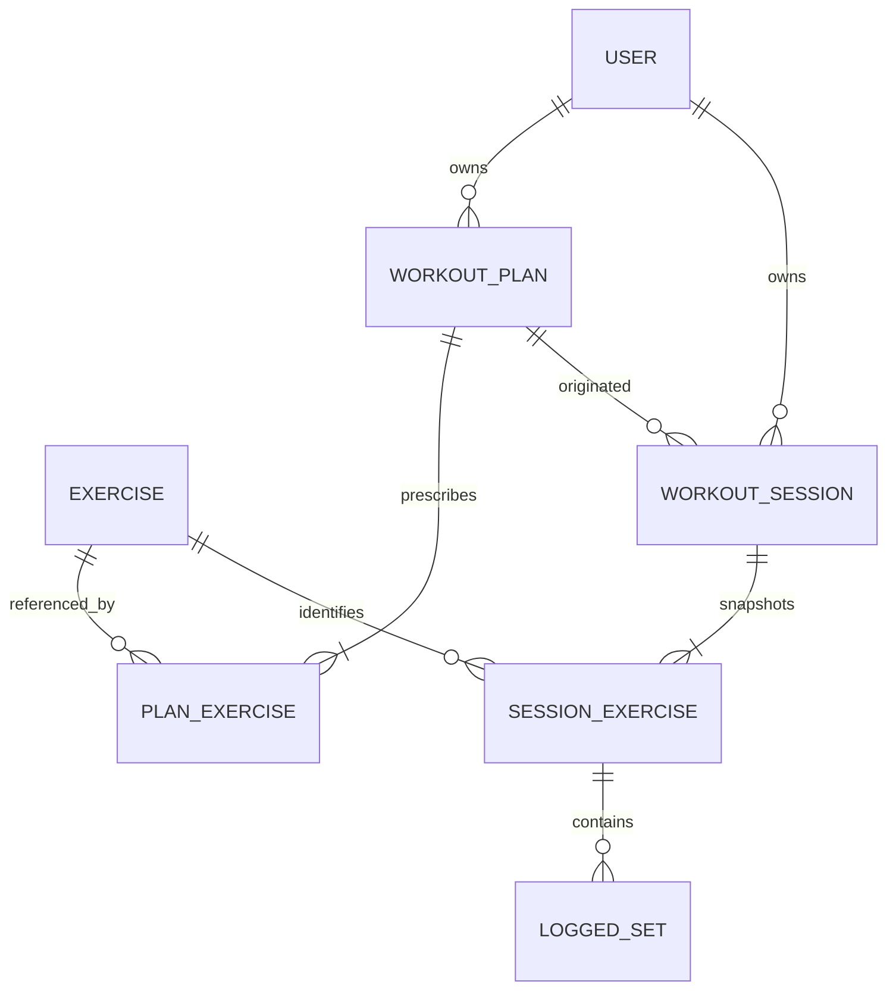

# Transmute Flutter demonstration: domain and data model

## Conventions

- IDs are UUID strings.
- Timestamps are UTC ISO-8601 strings, for example `2026-08-11T16:20:00Z`.
- `DateTime` fields are required unless marked nullable.
- All persisted weight uses `weightKg` as canonical kilograms. UI converts only
  for display/input according to `User.weightUnit` (`kg` or `lb`).
- Money-style decimal values use JSON numbers in the demo API and Dart `double`
  at the boundary. Display formatting must never drive stored values.

## Entities

### User

| Field | Type | Required | Notes |
| --- | --- | --- | --- |
| `id` | UUID | Yes | Stable identity. |
| `username` | string | Yes | Unique, normalized lowercase. |
| `displayName` | string | No | Nullable. |
| `weightUnit` | `"kg" \| "lb"` | Yes | Display preference only. |
| `createdAt` | timestamp | Yes | Server assigned. |

```json
{"id":"9d4f3ddd-9817-4cc5-946b-9c0046ad93c5","username":"demo","displayName":"Demo Lifter","weightUnit":"lb","createdAt":"2026-08-01T12:00:00Z"}
```

### Exercise

| Field | Type | Required | Notes |
| --- | --- | --- | --- |
| `id` | UUID | Yes | Stable catalog identity. |
| `name` | string | Yes | Immutable for session snapshot purposes. |
| `muscleGroup` | string | No | Display metadata. |
| `category` | `strength \| cardio \| mobility` | Yes | Catalog metadata. |

```json
{"id":"84c9a056-7f17-459b-86d1-bbc698867397","name":"Barbell bench press","muscleGroup":"Chest","category":"strength"}
```

### WorkoutPlan

The original focused-demo document represented exercises directly on a plan.
The implemented mock core loop now uses explicit `WorkoutPlanDay` records with
ordered `PlanExercise` prescriptions. A selected `planDayId` is recorded on
each workout session. This matches the shape that the Expo product requires,
while its exact API adapter remains a later step.

| Field | Type | Required | Notes |
| --- | --- | --- | --- |
| `id` | UUID | Yes | Plan identity. |
| `userId` | UUID | Yes | Owner. |
| `name` | string | Yes | 2–80 characters. |
| `description` | string | No | 0–200 characters. |
| `exercises` | `PlanExercise[]` | Yes | Ordered, at least one for startability. |
| `createdAt` / `updatedAt` | timestamp | Yes | Server assigned. |

### PlanExercise

| Field | Type | Required | Notes |
| --- | --- | --- | --- |
| `id` | UUID | Yes | Prescribed-row identity. |
| `planId` | UUID | Yes | Parent plan. |
| `exerciseId` | UUID | Yes | Catalog reference. |
| `sortOrder` | integer | Yes | Zero-based unique within plan. |
| `targetSets` | integer | Yes | 1–20. |
| `targetReps` | integer | Yes | 1–100. |
| `targetWeightKg` | number | No | Canonical target. |

```json
{"id":"752f8f8d-04d8-4ae2-a5c1-8efb03ef9f85","planId":"2fe5c405-5935-4f48-887d-75d89c40bbca","exerciseId":"84c9a056-7f17-459b-86d1-bbc698867397","sortOrder":0,"targetSets":3,"targetReps":8,"targetWeightKg":61.235}
```

### WorkoutSession

| Field | Type | Required | Notes |
| --- | --- | --- | --- |
| `id` | UUID | Yes | Session identity. |
| `userId` | UUID | Yes | Owner. |
| `planId` | UUID | Yes | Source plan, retained for traceability only. |
| `planNameSnapshot` | string | Yes | Historical display name. |
| `status` | `active \| completed \| discarded` | Yes | State machine value. |
| `startedAt` | timestamp | Yes | Server assigned at start. |
| `completedAt` | timestamp | No | Required only when completed. |
| `discardedAt` | timestamp | No | Required only when discarded. |
| `restEndsAt` | timestamp | No | Absolute deadline; null means inactive/paused timer. |
| `exercises` | `SessionExercise[]` | Yes | Ordered historical snapshots. |
| `updatedAt` | timestamp | Yes | Server assigned. |

### SessionExercise

| Field | Type | Required | Notes |
| --- | --- | --- | --- |
| `id` | UUID | Yes | Session-row identity. |
| `sessionId` | UUID | Yes | Parent session. |
| `exerciseId` | UUID | Yes | Catalog identity for matching history. |
| `exerciseNameSnapshot` | string | Yes | Historical name. |
| `muscleGroupSnapshot` | string | No | Historical metadata. |
| `sortOrder` | integer | Yes | Zero-based unique within session. |
| `targetSetsSnapshot` | integer | Yes | 1–20. |
| `targetRepsSnapshot` | integer | Yes | 1–100. |
| `targetWeightKgSnapshot` | number | No | Historical target. |
| `previousPerformance` | `PreviousPerformance` | No | Read model; not authoritative session data. |
| `sets` | `LoggedSet[]` | Yes | Ordered by `setOrder`. |

`PreviousPerformance` contains `sessionId`, `completedAt`, `weightKg`, and
`reps`; it is the latest working set from a prior completed session for the
same `exerciseId`.

### LoggedSet

| Field | Type | Required | Notes |
| --- | --- | --- | --- |
| `id` | UUID | Yes | Set identity. |
| `sessionExerciseId` | UUID | Yes | Parent session exercise. |
| `setOrder` | integer | Yes | One-based unique within session exercise. |
| `weightKg` | number | Yes | Canonical `0–1000`. |
| `reps` | integer | Yes | `1–100`. |
| `completedAt` | timestamp | Yes | Server assigned. |

```json
{"id":"2c0d97fe-1a23-4552-9f1f-823b37a76581","sessionExerciseId":"1a1947d2-b22f-4aed-b9db-6d7f2cacf2a7","setOrder":2,"weightKg":61.235,"reps":8,"completedAt":"2026-08-11T16:34:00Z"}
```

## Aggregate relationships



## Domain invariants

1. A user has **at most one** `active` workout session. Enforce it in the
   persistence transaction/unique constraint, not only in Flutter state.
2. Only an active session accepts set edits, session-exercise additions/removal,
   rest-deadline changes, completion, or discard.
3. A completed session and its snapshots are immutable. A discarded session is
   excluded from history and cannot be resumed.
4. Starting a session atomically snapshots plan name, exercise name/metadata,
   order, and target fields. Later plan or catalog changes cannot rewrite
   historical evidence.
5. A `SessionExercise` can appear at most once in one session for a given
   `exerciseId`. It may be removed only when it has no logged sets.
6. `LoggedSet.setOrder` is contiguous and one-based per `SessionExercise`.
   Server assigns/recalculates it; clients never choose it.
7. `completedAt` is non-null iff session status is `completed`; `discardedAt`
   is non-null iff status is `discarded`; the two are mutually exclusive.
8. `restEndsAt` is an absolute future/past timestamp, never a remaining
   counter. Remaining seconds are `max(0, restEndsAt - clock.now())`.
9. The latest previous performance ignores the current session, discarded
   sessions, and any non-completed historical session.
10. API actor identity determines all owner-scoped reads/writes. User IDs in
    request payloads are forbidden.
