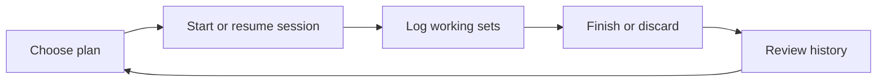

# Transmute Flutter demonstration: build specification

## Purpose and scope

Build a polished, production-style demonstration of one closed loop:

The app proves Flutter across responsive screens, protected routing, REST and
mock repositories, durable active-session recovery, and accessible desktop
interaction. It is intentionally **not** a port of the whole Transmute app.

## Routes

| Route | Guard | Screen | Primary purpose |
| --- | --- | --- | --- |
| `/login` | Public | LoginScreen | Demo login and session restore entry point. |
| `/plans` | Authenticated | PlanListScreen | Browse plans and select one. |
| `/plans/:planId` | Authenticated | PlanDetailScreen | Inspect prescribed exercises, targets, prior performance, and start work. |
| `/session` | Authenticated | ActiveSessionScreen | Resume the single active session. Redirect to plans when absent. |
| `/history` | Authenticated | HistoryScreen | Browse completed sessions. |
| `/history/:sessionId` | Authenticated | CompletedSessionScreen | Inspect completed evidence, volume, and duration. |

The current mock implementation expands `/plans/:planId` into a plan builder:
it can create plans, manage explicit training days, insert exercises from the
catalog, edit prescriptions, and start a selected day. The old standalone API
names in this document are not compatible with the Expo API; see
`API_CONTRACT.md` and `FLUTTER_PARITY_PLAN.md` before enabling API mode.

`/` redirects to `/plans` for a valid persisted session, otherwise `/login`.
An authenticated user visiting `/login` redirects to `/plans`. A protected
route performs a session check before rendering; an expired/invalid credential
clears secure storage and redirects to `/login`.

## Screens and exact behavior

### Login

Show wordmark, `Username` field, `Password` field, `Sign in` button, and a
small `Demo credentials: demo / transmute-demo` hint in mock mode only.

- Both fields are required. Username is trimmed; password is not trimmed.
- Disable submit while a request is active.
- Invalid credentials show a form-level error without clearing input.
- Network/server failures show a retryable form-level error.
- On success, persist the session and route to `/plans`.

### Plan list

Show an app shell, page heading `Workout plans`, active-session banner when
one exists, and plan cards sorted by `updatedAt` descending.

Each plan card shows name, optional description, day count, exercise count,
and `Open plan`. The active-session banner has `Resume workout` and takes
precedence over a new start action.

States:

- Loading: three non-interactive skeleton cards.
- Empty: plain-language explanation and `Retry`; no create-plan control is in
  scope.
- Failure: error panel with `Retry`.
- Success: responsive card list.

### Plan detail

Show back navigation, plan name/description, ordered `PlanExercise` rows, and
one `Start workout` action. Each row shows exercise name, muscle group when
present, target sets/reps/weight, and previous completed performance.

- If an active session exists, replace `Start workout` with `Resume workout`;
  do not issue a start request.
- Starting uses the selected plan ID and snapshots the displayed prescription
  into the created session. On success route to `/session`.
- A `409 active_session_exists` response refreshes active-session state and
  routes to `/session`.
- Missing plan: show an inline not-found state with a link to `/plans`.

### Active session

Show session title, plan name, start time, elapsed duration, persistent rest
timer, ordered session exercises, and a sticky action area.

Each session-exercise card contains:

- Snapshotted exercise name and target summary.
- Prior completed performance for that exercise.
- Completed set rows: ordinal, canonical/displayed weight, reps, and edit
  control while the session is active.
- An inline add-set form: weight, reps, and `Complete set`.
- `Remove exercise` only when the exercise has no logged sets; otherwise show
  an explanatory disabled state.

The screen also contains `Add exercise`, which opens a searchable dialog of
the supplied exercise catalog. Selecting an exercise adds a session snapshot,
not a mutable plan row. The dialog has loading, empty-search, retry, keyboard
focus, escape, and close-button behavior.

The rest timer shows presets `1:00`, `1:30`, `2:00`, custom minutes/seconds,
start/pause/reset, and a compact persistent form when scrolled. It is derived
from `restEndsAt`; a rebuild/restart recalculates the remaining duration from
that timestamp. The session repository persists timer updates.

The sticky actions are `Finish workout` and `Discard workout`. Discard opens a
destructive confirmation dialog stating that logged work will be removed. A
completed session is read-only and routes to its history detail.

### History and completed-session detail

History lists only completed sessions, newest first. Each item shows title,
completed timestamp, duration, completed working-set count, and total volume.
Loading, empty, error, and retry states follow the Plan list convention.

Completed detail shows the same immutable exercise/set snapshot, total volume,
duration, working-set count, and completed timestamp. It has no mutation
controls. Its prior-performance values must be usable by the next active
session of the same exercise.

## Cross-screen state requirements

- There is at most one active session per user. The UI must always discover
  and resume it before exposing a start action. The API enforces this too.
- A successful set completion is optimistic: insert a pending set row, disable
  only its duplicate submit action, then reconcile with the server ID/order.
  On failure remove the pending row, retain form input, and show `Retry`.
- Active session, sets, rest deadline, and session-exercise snapshots survive
  restart through the API. Secure local storage may cache the active session
  for fast startup, but cannot be the source of truth.
- Read queries must have loading, empty where meaningful, retryable failure,
  and successful states. Do not use blank screens for a failed fetch.

## Responsive and input behavior

| Width | Navigation | Content |
| --- | --- | --- |
| `<600dp` | Bottom navigation: Plans, Workout, History | One column; sticky mobile session actions. |
| `600–1023dp` | Navigation rail | Flexible one/two columns; max content width 900dp. |
| `>=1024dp` | Persistent sidebar | Centered desktop content, max 1180dp; session cards can use a two-column layout. |

All controls are usable with touch, keyboard, mouse, and screen reader. Focus
order follows visual order. Enter submits an active form, Escape closes dialogs,
and dialogs restore focus to their trigger. Never rely on hover for required
information or action.

## Validation

| Field | Rule |
| --- | --- |
| Username | Required after trim; 3–64 non-whitespace characters. |
| Password | Required; 8–128 characters. |
| Set weight | Required for this demo; decimal number `>= 0` and `<= 1000 kg`. |
| Set reps | Required integer `1–100`. |
| Rest duration | `10–600` seconds; accept `m:ss` or whole minutes. |
| Add exercise | Must select an exercise not already in the active session. |

Show validation next to the invalid field and announce it accessibly. Server
validation errors take precedence when they disagree with client checks.

## Acceptance criteria

- Demo login persists across restart; logout removes credentials and protected
  routes become inaccessible.
- A plan can start a session only when no active session exists.
- A restarted app resumes the same active session and recalculates an active
  rest timer from its deadline.
- A set is optimistically shown, reconciles on success, and can be retried on
  failure without lost form input.
- A completed session cannot receive sets or session-exercise mutations.
- A discarded session disappears from active state and history.
- Completed history reports duration and `sum(weightKg * reps)` volume.
- Previous performance is supplied on plan detail and active session for the
  exact exercise ID, taken from the latest earlier completed session.
- No overflow at 375dp, 768dp, and 1440dp widths; shell navigation matches the
  table above.

## Explicit exclusions

Do not implement registration, nutrition, fasting, recovery coaching, Arcana,
AI plans, barcode/label capture, social features, admin, editable workout
plans, media uploads, analytics, or offline write queues. The only exercise
management in scope is adding/removing a session exercise from the provided
catalog.

## Reference mapping

Use current Transmute behavior as a product reference, not a pixel-copy:

| Flutter surface | Existing implementation reference |
| --- | --- |
| Responsive shell | `src/components/record-screen.tsx` |
| Plan and exercise treatment | `src/components/record-screen.tsx` (`WorkoutPlansContent`) |
| Active logger, rest timer, completion | `src/app/sessions/[id].tsx` |
| Recovery of persisted auth | `src/lib/api.ts` (`resumeSession`) |
| Theme source | `src/theme/transmute-theme.tsx` |

No screenshots are included because browser visual verification belongs to the
human QA pass. The Flutter implementation must capture its own 375dp and
1440dp screenshots before declaring completion.
