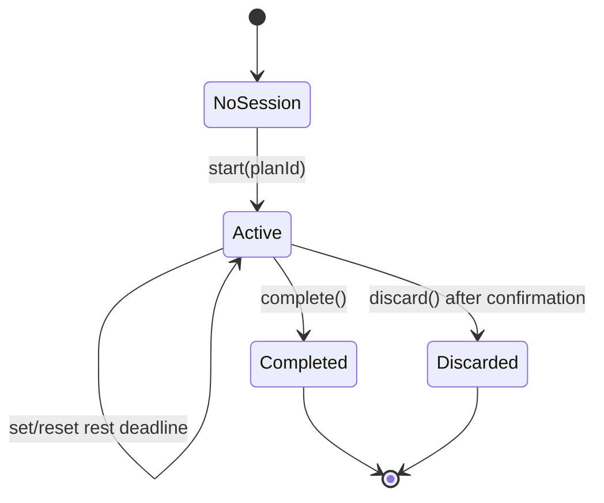

# Active-session state transition specification

## State machine

`NoSession` means the authenticated API returns `session: null` from
`GET /workout-sessions/active`. It does not mean a local cache has been lost.

## Legal commands by state

| Command | NoSession | Active | Completed | Discarded |
| --- | --- | --- | --- | --- |
| Start from plan | Allowed | Reject `409 active_session_exists` | New session allowed | New session allowed |
| Read session | N/A | Allowed | Allowed | `404 session_not_found` to normal client queries |
| Add/remove session exercise | N/A | Allowed, subject to rule | Reject `409 session_not_active` | Reject/not found |
| Create/edit/delete set | N/A | Allowed | Reject `409 session_not_active` | Reject/not found |
| Update rest deadline | N/A | Allowed | Reject `409 session_not_active` | Reject/not found |
| Complete | N/A | Allowed | Reject `409 session_not_active` | Reject/not found |
| Discard | N/A | Allowed after UI confirmation | Reject `409 session_not_active` | Reject/not found |

Removal of a session exercise is legal only if it has zero logged sets;
otherwise return `409 exercise_has_sets`. The active session is never deleted
silently by navigation/back behavior.

## Start transition

`POST /workout-sessions {planId}` performs atomically:

1. Authenticate actor and verify ownership of the plan.
2. Check/lock the actor’s active-session row or unique constraint.
3. If an active session exists, return `409 active_session_exists` with its ID.
4. Snapshot plan and ordered plan exercises into the new active session.
5. Set `startedAt`/`updatedAt`; set `completedAt`, `discardedAt`, and
   `restEndsAt` to null.
6. Return the canonical `WorkoutSessionDetail`.

## Mutation and persistence rules

- The server assigns logged-set ID, completion timestamp, and contiguous
  `setOrder`. Flutter may show a temporary pending row but must replace/remove
  it from the server result/error.
- The client saves any changed `restEndsAt` through `PATCH /workout-sessions/:id`
  before relying on it for restart recovery. A paused/reset timer is persisted
  as `null`.
- Finishing stamps `completedAt` and prevents every later mutation. The server
  calculates durable duration from `startedAt` and `completedAt`.
- Discarding stamps `discardedAt`, removes it from the active projection, and
  excludes it from completed history. It must not delete evidence directly from
  a client-side cache before the server confirms.

## Restart, refresh, and conflict handling

At authenticated application launch and on every foreground resume:

1. Restore/refresh credentials.
2. Call `GET /workout-sessions/active`.
3. When a session exists, replace local active-session state with server data.
4. Calculate timer remaining time from `restEndsAt - injectedClock.now()`;
   render elapsed and clear local visual countdown when the result is `<= 0`.
5. If no session exists, invalidate active-session-only local state.

If a mutation receives `409 session_not_active`, refresh the session. If it is
now completed, route to `/history/:id`; if discarded/missing, clear active
state and route to `/plans`. If `409 active_session_exists` occurs during
start, fetch/route to the returned active session. Do not create a second local
session or silently retry a conflict.
